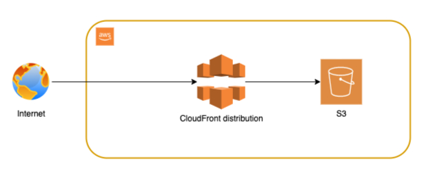

# 🌐 Serverless Portfolio Hosting with AWS S3 + CloudFront + Terraform

This project demonstrates how to securely host a static portfolio website using AWS S3 and CloudFront, fully provisioned using Terraform. The site is deployed as a public-facing HTTPS website using CloudFront’s default TLS certificate.

---

## 📦 What’s Inside

- ✅ Static site (based on [StartBootstrap Resume](https://startbootstrap.com/theme/resume))
- ✅ AWS S3 (for storage) — no public access
- ✅ AWS CloudFront (as CDN + HTTPS frontend)
- ✅ Terraform for Infrastructure as Code
- ✅ OAI (Origin Access Identity) to protect S3
- ✅ CloudFront Default HTTPS (no ACM required)

---

## 🧭 Architecture Diagram

